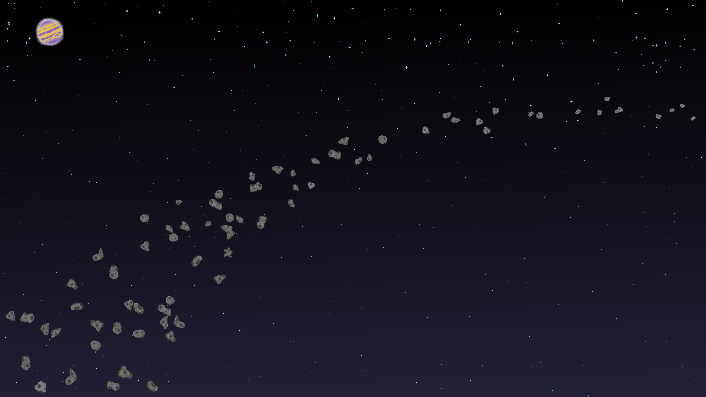

  

  <h1 align="center">M.I.S.T.</h1>
  <h6 align="center">magnetometer + imager + spectrometer + thruster</h6>

   <p4 align="center" ><i>Created by:</i></p4> 
  <p5 align="center">Bryant Lopez Roman</p5> 
  <p5 align="center">Dhalia Nguyen</p5> 
  <p5 align="center">James Oliver</p5> 
  <p5 align="center">Joshua Benn</p5> 
  <p5 align="center">Matthew Myers</p5>  

## Overview

A futuristic adventure exploration 2D platformer using tools inspired by the Psyche spacecraft to navigate a new environment.

## Controls

Movement  | Jump | Thrusters | Spectrometer | Emagnet | Magnetometer | Imager
:---------: | :-----:| :----------:| :------------: | :-------: | :------------: | :------:
WASD      | Spacebar(tap) | Spacebar(hold) | G | Left Click | Passive | Passive

### Built With

* [![Unity][Unity.img]][Unity-url]
* [![VS][VS.img]][VS-url]
* [![Taiga][Taiga.img]][Taiga-url]
* [![Discord][Discord.img]][Discord-url]
* [![Slack][Slack.img]][Slack-url]
* [![Github][Github.img]][Github-url]

### Main Features

- [x] Resource gathering and management
- [x] Developer console showing hardware specific benchmarks
- [x] Multiple levels with tool-specific navigation
- [x] Custom artwork and animations
- [x] Links to educational NASA resources
- [x] Colorblind accessibility options
- [x] Upgradable tool enhancements
- [x] UI overlay
- [x] Atmospheric audio integration

<!-- MARKDOWN LINKS & IMAGES -->
[Unity-url]: https://unity.com/
[Unity.img]: https://img.shields.io/badge/Unity-100000?style=for-the-badge&logo=unity&logoColor=white
[Taiga-url]: https://tree.taiga.io/project/lopezroman-psyche_web_game/timeline
[Taiga.img]: https://img.shields.io/badge/TAIGA-style=flat&color=green
[VS.img]: https://img.shields.io/badge/Visual_Studio-5C2D91?style=for-the-badge&logo=visual%20studio&logoColor=white
[VS-url]: https://visualstudio.microsoft.com/
[VS.img]: https://img.shields.io/badge/Visual_Studio-5C2D91?style=for-the-badge&logo=visual%20studio&logoColor=white
[Discord-url]: https://discord.com/
[Discord.img]: https://img.shields.io/badge/Discord-7289DA?style=for-the-badge&logo=discord&logoColor=white
[Slack-url]: https://slack.com/
[Slack.img]: https://img.shields.io/badge/Slack-4A154B?style=for-the-badge&logo=slack&logoColor=white
[Github-url]: https://github.com/MissionToPsyche/tungsten_12a_web_game-se
[Github.img]: https://img.shields.io/badge/GitHub-100000?style=for-the-badge&logo=github&logoColor=white
