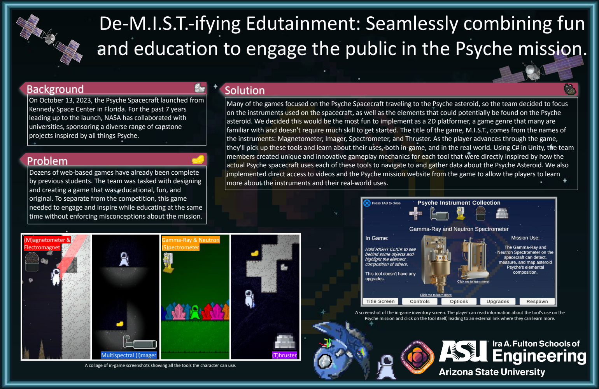
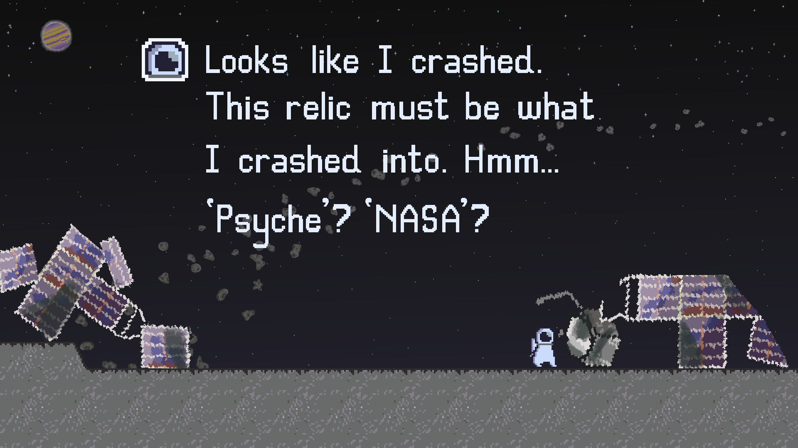
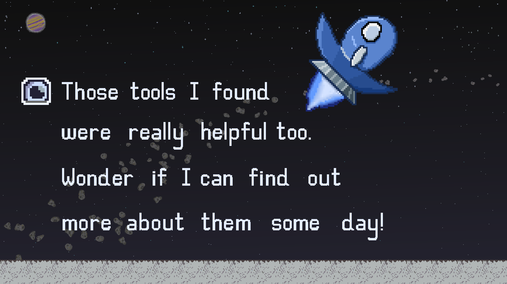

  <a href="https://missiontopsyche.github.io/tungsten_12a_web_game-se/M.I.S.T/">
    https://github.com/MissionToPsyche/tungsten_12a_web_game-se/blob/US679_Task680/README.md
  </a>
  
  <h1 align="center">M.I.S.T.</h1>
  <h6 align="center">magnetometer + imager + spectrometer + thruster</h6>
  
   <p4 align="center" ><i>Created by:</i></p4> 
  <p5 align="center">Bryant Lopez Roman</p5> 
  <p5 align="center">Dhalia Nguyen</p5> 
  <p5 align="center">James Oliver</p5> 
  <p5 align="center">Joshua Benn</p5> 
  <p5 align="center">Matthew Myers</p5>  

# Overview
A futuristic adventure exploration 2D platformer using tools inspired by the Psyche spacecraft to navigate a new environment.
In the far, distant future, after getting lost and crashing into the old Psyche spacecraft, a space delivery driver ends up
stranded on the Psyche asteroid. Find elements throughout 7 unique levels to upgrade your tools, collect 8 tungsten pieces to
fix up the ship, and get this poor delivery driver back on track!

  
  

### Access URL: [Play M.I.S.T.](https://missiontopsyche.github.io/tungsten_12a_web_game-se/M.I.S.T/)

### Leave Feedback: [M.I.S.T. Game Feedback Form](https://docs.google.com/forms/d/e/1FAIpQLSd8H6gbkJdhOj6H3-D0T2M22WIM07zK0cMOKndf9nf4uXr3FA/viewform?usp=sf_link)

# Controls
* <b>Movement:</b> WASD/Arrow Keys
* <b>Inventory:</b> ESC/Tab
* <b>Jump:</b> Spacebar(tap)
* <b>Thruster:</b> Spacebar(hold)/T
* <b>Spectrometer:</b> Right Click/G
* <b>Electro-Magnet:</b> Left Click/E
* <b>Magnetometer:</b> Passive
* <b>Imager:</b> Passive

# Main Features
- [x] 7 levels (+1 tutorial level) with tool-specific navigation
- [x] Resource gathering and management
- [x] Upgradable tool enhancements
- [x] Links to educational NASA resources for the Psyche mission
- [x] Developer console showing hardware specific benchmarks
- [x] UI overlay
- [x] Colorblind accessibility option
- [x] Atmospheric audio integration
- [x] Original storyline
- [x] Custom artwork and animations
      
### Built With
* [![Unity][Unity.img]][Unity-url]
* [![VS][VS.img]][VS-url]
* [![Taiga][Taiga.img]][Taiga-url]
* [![Discord][Discord.img]][Discord-url]
* [![Slack][Slack.img]][Slack-url]
* [![Github][Github.img]][Github-url]
* [![Aseprite][Aseprite.img]][Aseprite-url]

<!-- MARKDOWN LINKS & IMAGES -->
[Unity-url]:  https://unity.com/
[Taiga-url]:  https://tree.taiga.io/project/lopezroman-psyche_web_game/timeline
[VS-url]:     https://visualstudio.microsoft.com/
[Discord-url]:https://discord.com/
[Slack-url]:  https://slack.com/
[Github-url]: https://github.com/MissionToPsyche/tungsten_12a_web_game-se
[Aseprite-url]: https://www.aseprite.org/

[Unity.img]:  https://img.shields.io/badge/Unity-100000?style=for-the-badge&logo=unity&logoColor=white
[Taiga.img]:  https://img.shields.io/badge/TAIGA-style=flat&color=green
[VS.img]:     https://img.shields.io/badge/Visual_Studio-5C2D91?style=for-the-badge&logo=visual%20studio&logoColor=white
[Discord.img]:https://img.shields.io/badge/Discord-7289DA?style=for-the-badge&logo=discord&logoColor=white
[Slack.img]:  https://img.shields.io/badge/Slack-4A154B?style=for-the-badge&logo=slack&logoColor=white
[Github.img]: https://img.shields.io/badge/GitHub-100000?style=for-the-badge&logo=github&logoColor=white
[Aseprite.img]: https://img.shields.io/badge/Aesprite-7D929E?style=for-the-badge&logo=aseprite&logoColor=white

# Run WebGL locally with Unity
### Requirements
- Simple Web Server:\
  Typically in\
  "...\Unity\Hub\Editor\2022.3.9f1\Editor\Data\PlaybackEngines\WebGLSupport\BuildTools\SimpleWebServer.exe"
- Cmd:\
  SimpleWebServer.exe <"path">\M.I.S.T <"port">
  - Example: .\SimpleWebServer.exe "D:\1. Temp\tungsten_12a_web_game-se\M.I.S.T" 9000
- Navigate to URL:
  - http://localhost:9000/

# Leave us some feedback :)
<iframe src="https://docs.google.com/forms/d/e/1FAIpQLSd8H6gbkJdhOj6H3-D0T2M22WIM07zK0cMOKndf9nf4uXr3FA/viewform?embedded=true" width="640" height="666" frameborder="0" marginheight="0" marginwidth="0">Loading…</iframe>
