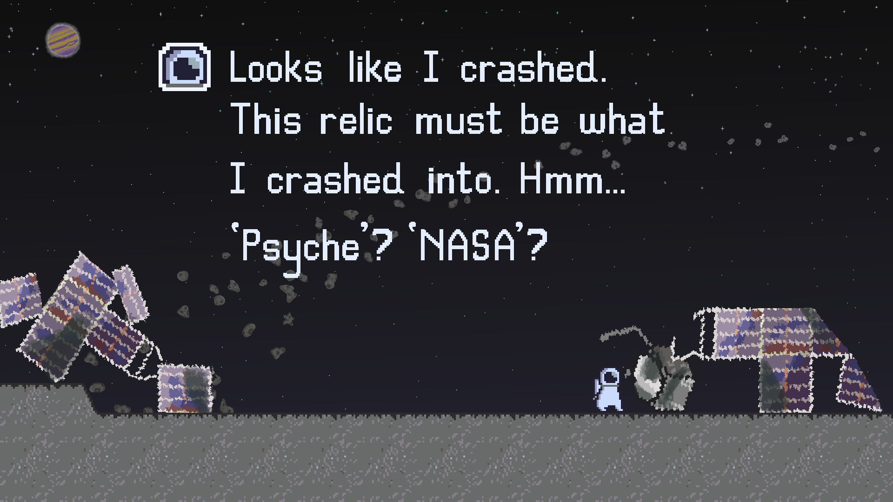
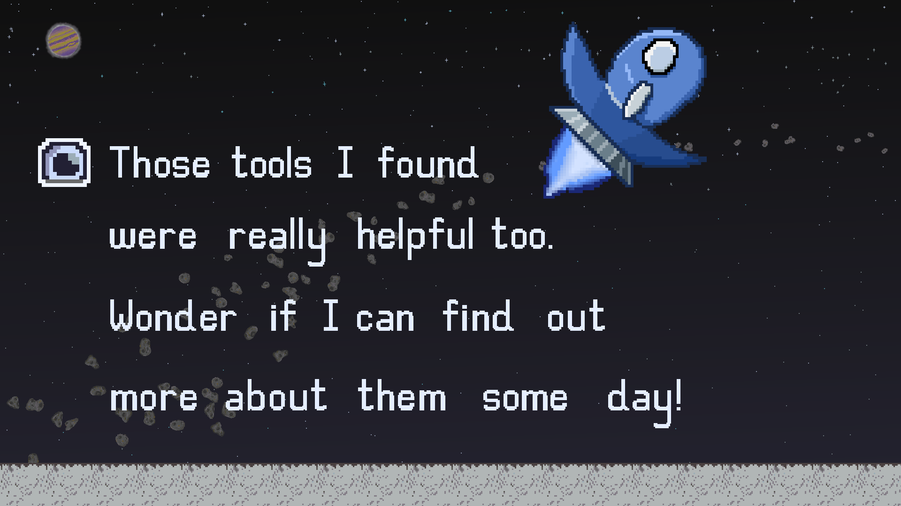

  

  <h1 align="center">M.I.S.T.</h1>
  <h6 align="center">magnetometer + imager + spectrometer + thruster</h6>

  
  
  
  

   <p4 align="center" ><i>Created by:</i></p4> 
  <p5 align="center">Bryant Lopez Roman</p5> 
  <p5 align="center">Dhalia Nguyen</p5> 
  <p5 align="center">James Oliver</p5> 
  <p5 align="center">Joshua Benn</p5> 
  <p5 align="center">Matthew Myers</p5>  

## Overview

A futuristic adventure exploration 2D platformer using tools inspired by the Psyche spacecraft to navigate a new environment.
In the far, distant future, after getting lost and crashing into the old Psyche spacecraft, a space delivery driver ends up
stranded on the Psyche asteroid. Find elements throughout 7 unique levels to upgrade your tools, collect 8 tungsten pieces to
fix up the ship, and get this poor delivery driver back on track!

  
  

## Controls

Movement  | Inventory | Jump | Thrusters | Spectrometer | Emagnet | Magnetometer | Imager
:---------: | :-----: | :-----: | :----------:| :------------: | :-------: | :------------: | :------:
WASD/Arrow Keys | ESC/Tab | Spacebar(tap) | Spacebar(hold)/T | Right Click/G | Left Click/E | Passive | Passive

## Main Features

- [x] 7 levels (+1 tutorial level) with tool-specific navigation
- [x] Resource gathering and management
- [x] Upgradable tool enhancements
- [x] Links to educational NASA resources for the Psyche mission
- [x] Developer console showing hardware specific benchmarks
- [x] UI overlay
- [x] Colorblind accessibility option
- [x] Atmospheric audio integration
- [x] Original storyline
- [x] Custom artwork and animations

## Built With

* [![Unity][Unity.img]][Unity-url]
* [![VS][VS.img]][VS-url]
* [![Taiga][Taiga.img]][Taiga-url]
* [![Discord][Discord.img]][Discord-url]
* [![Slack][Slack.img]][Slack-url]
* [![Github][Github.img]][Github-url]
* [![Aseprite][Aseprite.img]][Aseprite-url]

<!-- MARKDOWN LINKS & IMAGES -->
[Unity-url]: https://unity.com/
[Unity.img]: https://img.shields.io/badge/Unity-100000?style=for-the-badge&logo=unity&logoColor=white
[Taiga-url]: https://tree.taiga.io/project/lopezroman-psyche_web_game/timeline
[Taiga.img]: https://img.shields.io/badge/TAIGA-style=flat&color=green
[VS.img]: https://img.shields.io/badge/Visual_Studio-5C2D91?style=for-the-badge&logo=visual%20studio&logoColor=white
[VS-url]: https://visualstudio.microsoft.com/
[VS.img]: https://img.shields.io/badge/Visual_Studio-5C2D91?style=for-the-badge&logo=visual%20studio&logoColor=white
[Discord-url]: https://discord.com/
[Discord.img]: https://img.shields.io/badge/Discord-7289DA?style=for-the-badge&logo=discord&logoColor=white
[Slack-url]: https://slack.com/
[Slack.img]: https://img.shields.io/badge/Slack-4A154B?style=for-the-badge&logo=slack&logoColor=white
[Github-url]: https://github.com/MissionToPsyche/tungsten_12a_web_game-se
[Github.img]: https://img.shields.io/badge/GitHub-100000?style=for-the-badge&logo=github&logoColor=white
[Aseprite-url]: https://www.aseprite.org/
[Aseprite.img]: https://img.shields.io/badge/Aesprite-7D929E?style=for-the-badge&logo=aseprite&logoColor=white
